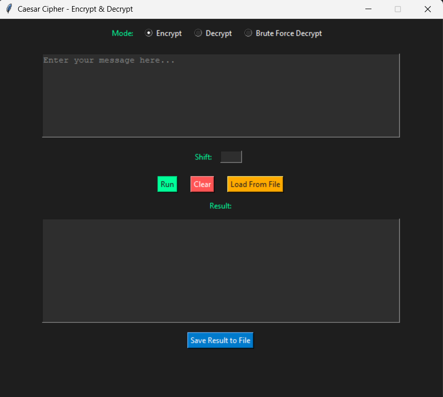

# 🛡️ Caesar Cipher GUI Tool

A modern, hacker-themed Caesar Cipher tool with a professional graphical interface. Built with Python and Tkinter, this tool supports text encryption, decryption, brute-force cracking, and file input/output. Perfect for educational use, demonstrations, or lightweight encryption tasks.

---

## 📸 Preview

 <!-- (Optional: Add screenshot of GUI) -->

---

## ✨ Features

✅ **Encrypt & Decrypt Text**  
✅ **Brute-Force Decryption Mode** — Try all 25 shifts automatically  
✅ **Load Text from `.txt` File**  
✅ **Dark Hacker-Themed GUI**  
✅ **Auto Placeholder Handling in Text Input**  
✅ **Shift Input Disables When Not Needed**  
✅ **Save Output to File**

---

## 🚀 Getting Started

### 📦 Requirements
- Python 3.7+
- Tkinter (comes with Python)

### 📁 Clone the Project

```bash
git clone https://github.com/yourusername/caesar-cipher-gui.git
cd caesar-cipher-gui
```

### ▶️ Run the App

```bash
python gui.py
```

---

## 🧠 How It Works

The Caesar Cipher is a simple substitution cipher where each letter in the plaintext is shifted a certain number of places down the alphabet.

Example:  
- **Plaintext:** `HELLO`  
- **Shift = 3**  
- **Encrypted:** `KHOOR`

Brute-force mode tests all 25 possible shifts and displays them to help users identify the original message without knowing the shift.

---

## 🗂️ Project Structure

```
📁 caesar-cipher-gui/
├── gui.py              # Main GUI logic
├── cipher.py           # Caesar encryption/decryption functions
├── utils.py            # File load/save utility
├── README.md           # You're here!
└── output.txt          # (Example result file)
```

---

## 📥 Example File Usage

- Use **“Load From File”** to load a `.txt` file into the message input area.
- Edit or run Caesar Cipher directly from that text.
- Save your encrypted/decrypted result using **“Save Result to File”**.

---

## 🎯 Use Cases

- Educational demonstrations in cryptography
- Classic cipher cracking (brute-force)
- Lightweight, offline text obfuscation

--- 

## 🧑‍💻 Author

**Aman Patel**  
🔗 *Built as part of an internship project to explore real-world cybersecurity tools.*  

---

## 📜 License

MIT License — free to use, share, and modify.

---

> *“The only secure cipher is one that's never implemented... unless it's this cool.”*